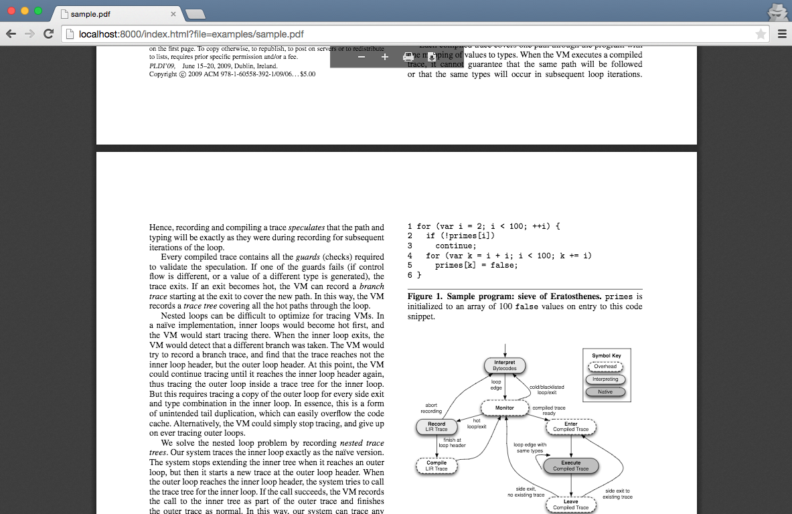

PDF Viewer
====
Lightweight PDF viewer using Mozila's [PDF JS](https://github.com/mozilla/pdf.js).

[![NPM version][npm-image]][npm-url]
[![Build Status][travis-image]][travis-url]

## Screenshot



## Pre-requirments

  Make sure `pdf.js`, `pdf.worker.js`, `viewer.js` and `viewer.css` is served by your own static server.

  You can clone our project, run command `node server` to start a simple static server to serve these files.

## Usage

  1. Include `src/index.js` in your html file:
  ```html
  <head>
    ...
    <script src="pdfviewer/dist/index.js"></script>
    ...
  </head>

  <body>
    ...
    <div id="container"></div>
    ...
  </body>
  ```

  2. Once you include `index.js`, you have a `PdfViewer` object, it takes a plain object as argument, and then you can `embed` it to your document, `#container` in this case:
  ```javascript
  new PdfViewer({pdfUrl: 'path/to/your/file', staticHost: 'path/to/your/static/host'}).embed(document.getElementById('container'))
  ```
  >*note*: The container you are going to embed to must be in the DOM tree already when you do the embed action.

## Options

  The options `PdfViewer` accepts are:

  1. **pdfUrl**(required):
    URL to your pdf file, can be relative or absolute. If it is a cross-domain path, the remote server must support [CORS](https://developer.mozilla.org/en-US/docs/Web/HTTP/Access_control_CORS).

  2. **staticHost**(required):
    Static files host, PdfViewer dependents on Mozila's `PDF.js` and our `viewer.js`, which must be served.

  3. **onerror**(optional):
    A custom `onerror` callback function, if error occurs when reading or rendering your pdf file, this function will be called.
    If omitted, our viewer's default error handler will be used.

## Examples

  Follow these steps to get a demo:

  1. Run command:
  ```shell
  npm install && gulp build && node server
  ```

  2. Go to your browser and open:
  ```
  http://localhost:8000/examples/index.html
  ```

## Who's using

+ Teambition: https://www.teambition.com/

[npm-url]: https://npmjs.org/package/pdfviewer
[npm-image]: http://img.shields.io/npm/v/pdfviewer.svg

[travis-url]: https://travis-ci.org/teambition/pdfviewer
[travis-image]: http://img.shields.io/travis/teambition/pdfviewer.svg
